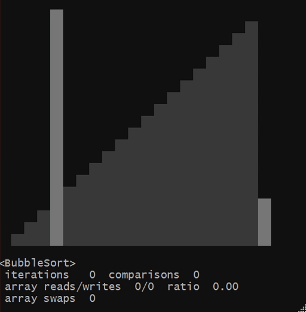

# Sorting Algorithm Comparator & Visualizer

Console program for fun with sorting algorithms.


Commands:
- **info**: shows information about one or more sorting algorithms such as complexity or pseudocode
- **compare:** compares two or more sorting algorithms on a real array of size up to 2^32-1
- **visualize:** visualizes the selected sorting algorithms

What the visualisation looks like on the _BubbleSort_ example (MINGW64):



## CLI 

To see what the program can do, type:

```shell
$ cvsort --help
```

<details>
    <summary>Output</summary>

```shell
      _____   _____  ___  ___ _____
     / __\ \ / / __|/ _ \| _ \_   _|
    | (__ \ V /\__ \ (_) |   / | |
     \___| \_/ |___/\___/|_|_\ |_|
_________________________________________
Sorting Algorithm Comparator & Visualizer

Usage: cvsort [options] [command] [command options]
  Options:
    --usage, --help, -h
      shows usage
    --disableBanner, --noBanner, -nb
      disables banner display
      Default: false
    --listNames, --names, -n
      prints the available sorting algorithms
      Default: false
    --listSpeedGears, --speeds, -s
      prints the available visualisation speeds of sorting algorithms
      Default: false
  Commands:
    info      shows information about one or more sorting algorithms
      Usage: info <name> [, <name-2>, ..., <name-20>]

    compare      compares two or more sorting algorithms
      Usage: compare [options] <name-1>, <name-2> [, ..., <name-10>]
        Options:
          --arrayFile, -f
            a file to save the array before sorting
            Default: array_2024-06-12-01-21-07-330.txt
          --arrayLength, -l
            array length: [2, 2^30)
            Default: 40
          --disableInfo, --noInfo, -ni
            switches off the display of sorting algorithm comparison
            information
            Default: false
          --printArray, -p
            prints the array to the specified file before sorting
            Default: false

    visualize      visualizes the selected sorting algorithms
      Usage: visualize [options] <name>
        Options:
          --arrayLength, -l
            array length: [10, 30]
            Default: 20
          --disableInfo, --noInfo, -ni
            switches off the display of information about the sorting
            algorithm
            Default: false
          --frameDelayMillis, --millis, -m
            sets the speed in milliseconds for the sorting visualisation:
            [50..4000]
          --skipShuffle, -ss
            switches off visualisation of array shuffling
            Default: false
          --speedGear, --speed, -s
            sets the speed for the sorting visualisation
            Default: G4
```

</details>

For example, information about BubbleSort:

```shell
$ cvsort info bubble
```

<details>
    <summary>Output</summary>

```shell
      _____   _____  ___  ___ _____
     / __\ \ / / __|/ _ \| _ \_   _|
    | (__ \ V /\__ \ (_) |   / | |
     \___| \_/ |___/\___/|_|_\ |_|
_________________________________________
Sorting Algorithm Comparator & Visualizer

┌────────┬────────────┬──────────────┬───────────┬────────┬────────────┬───────────┬────────┐
│ Sort   │ Worst time │ Average time │ Best time │ Memory │ Methods    │ Recursive │ Stable │
├────────┼────────────┼──────────────┼───────────┼────────┼────────────┼───────────┼────────┤
│ Bubble │ O(n^2)     │ Θ(n^2)       │ Ω(n)      │ O(1)   │ Exchanging │ No        │ Yes    │
└────────┴────────────┴──────────────┴───────────┴────────┴────────────┴───────────┴────────┘

for i in [0..n) do
    swapped = false
    for j in [1..n-i) do
        if array[j-1] > array[j] then
            swap array[j] and array[j+1]
            swapped = true
        end
    end

    if not swapped then
        break
    end
end
```

</details>

Or visualisation of BubbleSort:

```shell
$ cvsort visualize bubble
```

<details>
    <summary>Output</summary>

```shell
      _____   _____  ___  ___ _____
     / __\ \ / / __|/ _ \| _ \_   _|
    | (__ \ V /\__ \ (_) |   / | |
     \___| \_/ |___/\___/|_|_\ |_|
_________________________________________
Sorting Algorithm Comparator & Visualizer

┌────────┬────────────┬──────────────┬───────────┬────────┬────────────┬───────────┬────────┐
│ Sort   │ Worst time │ Average time │ Best time │ Memory │ Methods    │ Recursive │ Stable │
├────────┼────────────┼──────────────┼───────────┼────────┼────────────┼───────────┼────────┤
│ Bubble │ O(n^2)     │ Θ(n^2)       │ Ω(n)      │ O(1)   │ Exchanging │ No        │ Yes    │
└────────┴────────────┴──────────────┴───────────┴────────┴────────────┴───────────┴────────┘

                                ▒▒
                              ▒▒▒▒
                            ▒▒▒▒▒▒
                          ▒▒▒▒▒▒▒▒
                        ▒▒▒▒▒▒▒▒▒▒
                      ▒▒▒▒▒▒▒▒▒▒▒▒
                    ▒▒▒▒▒▒▒▒▒▒▒▒▒▒
                  ▒▒▒▒▒▒▒▒▒▒▒▒▒▒▒▒
                ▒▒▒▒▒▒▒▒▒▒▒▒▒▒▒▒▒▒
              ▒▒▒▒▒▒▒▒▒▒▒▒▒▒▒▒▒▒▒▒
            ▒▒▒▒▒▒▒▒▒▒▒▒▒▒▒▒▒▒▒▒▒▒
          ▒▒▒▒▒▒▒▒▒▒▒▒▒▒▒▒▒▒▒▒▒▒▒▒
        ▒▒▒▒▒▒▒▒▒▒▒▒▒▒▒▒▒▒▒▒▒▒▒▒▒▒
      ▒▒▒▒▒▒▒▒▒▒▒▒▒▒▒▒▒▒▒▒▒▒▒▒▒▒▒▒
    ▒▒▒▒▒▒▒▒▒▒▒▒▒▒▒▒▒▒▒▒▒▒▒▒▒▒▒▒▒▒
  ▒▒▒▒▒▒▒▒▒▒▒▒▒▒▒▒▒▒▒▒▒▒▒▒▒▒▒▒▒▒▒▒

<BubbleSort>
 iterations   121  comparisons  110
 array reads/writes  324/104  ratio  3.12
 array swaps  52
```

</details>

Or comparing SelectionSort & InsertionSort:

```shell
$ cvsort compare selection insertion
```

<details>
    <summary>Output</summary>

```shell
      _____   _____  ___  ___ _____
     / __\ \ / / __|/ _ \| _ \_   _|
    | (__ \ V /\__ \ (_) |   / | |
     \___| \_/ |___/\___/|_|_\ |_|
_________________________________________
Sorting Algorithm Comparator & Visualizer

┌───────────┬────────────┬──────────────┬───────────┬────────┬───────────┬───────────┬────────┐
│ Sort      │ Worst time │ Average time │ Best time │ Memory │ Methods   │ Recursive │ Stable │
├───────────┼────────────┼──────────────┼───────────┼────────┼───────────┼───────────┼────────┤
│ Selection │ O(n^2)     │ Θ(n^2)       │ Ω(n^2)    │ O(1)   │ Selection │ No        │ No     │
│ Insertion │ O(n^2)     │ Θ(n^2)       │ Ω(n)      │ O(1)   │ Insertion │ No        │ Yes    │
└───────────┴────────────┴──────────────┴───────────┴────────┴───────────┴───────────┴────────┘

array size: 40
elapsed time: 23 ms

<SelectionSort>
 iterations   819  comparisons  780
 array reads/writes  1632/72  ratio  22.67
 array swaps  36

<InsertionSort>
 iterations   401  comparisons  39
 array reads/writes  796/422  ratio  1.89
 array swaps  0
```

</details>

## Supported sorting algorithms

<table>
    <tr>
        <td><a href="https://en.wikipedia.org/wiki/Bubble_sort">BubbleSort</a></td>
        <td><a href="https://en.wikipedia.org/wiki/Bucket_sort">BucketSort</a></td>
        <td><a href="https://en.wikipedia.org/wiki/Comb_sort">CombSort</a></td>
        <td><a href="https://en.wikipedia.org/wiki/Counting_sort">CountingSort</a></td>
    </tr>
    <tr>
        <td><a href="https://en.wikipedia.org/wiki/Cycle_sort">CycleSort</a></td>
        <td><a href="https://en.wikipedia.org/wiki/Insertion_sort">InsertionSort</a></td>
        <td><a href="https://en.wikipedia.org/wiki/Gnome_sort">GnomeSort</a></td>
        <td><a href="https://en.wikipedia.org/wiki/Odd%E2%80%93even_sort">OddEvenSort</a></td>
    </tr>
    <tr>
        <td><a href="https://en.wikipedia.org/wiki/Pancake_sorting">PancakeSort</a></td>
        <td><a href="https://en.wikipedia.org/wiki/Quicksort">QuickSort</a></td>
        <td><a href="https://en.wikipedia.org/wiki/Radix_sort">RadixSort</a></td>
        <td><a href="https://en.wikipedia.org/wiki/Selection_sort">SelectionSort</a></td>
    </tr>
    <tr>
        <td><a href="https://en.wikipedia.org/wiki/Cocktail_shaker_sort">ShakerSort</a></td>
        <td><a href="https://en.wikipedia.org/wiki/Shellsort">ShellSort</a></td>
        <td><a href="https://en.wikipedia.org/wiki/Stooge_sort">StoogeSort</a></td>
        <td><a href="https://en.wikipedia.org/wiki/Tree_sort">TreeSort</a></td>
    </tr>
</table>