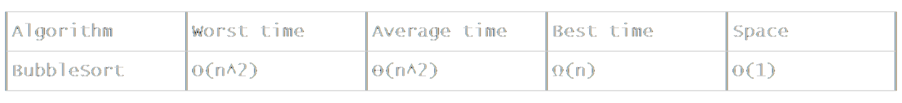
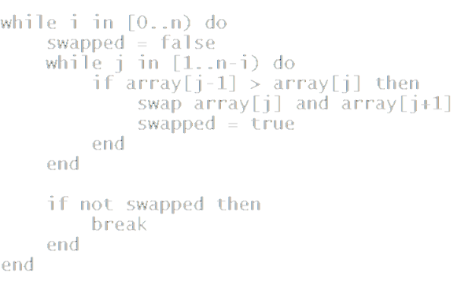
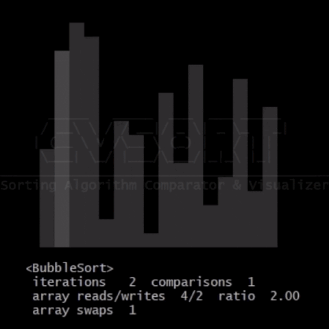

# Sorting Algorithm Comparator & Visualizer

Console program for fun with sorting algorithms.

Contains two main commands:
- **compare:** compares up to 10 sorting algorithms and shows their complexity and statistics
- **visualise:** shows algorithm complexity, pseudocode and/or visualisation with statistics

_BubbleSort_ complexity:

_BubbleSort_ pseudocode:

_BubbleSort_ visualisation:

Supported sorting algorithms:

- BubbleSort