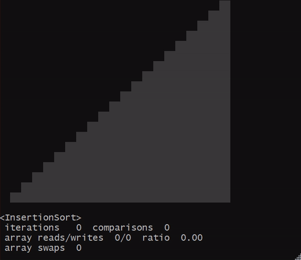
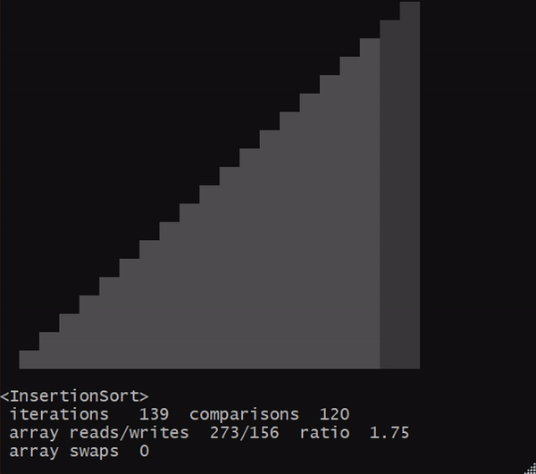

# Sorting Algorithm Comparator & Visualizer

Console program for fun with sorting algorithms.


Commands:
- **compare:** compares two or more sorting algorithms on an array of size up to 2^30-1
- **discover:** provides search attributes for discovering sorting algorithms
- **info**: shows information about one or more sorting algorithms such as complexity or pseudocode
- **list**: helps to understand other commands by providing parameter lists
- **visualize:** visualizes the selected sorting algorithm (even in the reverse direction)

What the _InsertionSort_ visualisation looks like (MINGW64):



And here is what the _InsertionSort_ visualization looks like in the reverse direction (MINGW64):



## Supported sorting algorithms

<table>
    <tr>
        <td><a href="https://en.wikipedia.org/wiki/Bubble_sort">BubbleSort</a></td>
        <td><a href="https://en.wikipedia.org/wiki/Bucket_sort">BucketSort</a></td>
        <td><a href="https://en.wikipedia.org/wiki/Comb_sort">CombSort</a></td>
        <td><a href="https://en.wikipedia.org/wiki/Counting_sort">CountingSort</a></td>
    </tr>
    <tr>
        <td><a href="https://en.wikipedia.org/wiki/Cycle_sort">CycleSort</a></td>
        <td><a href="https://en.wikipedia.org/wiki/Gnome_sort">GnomeSort</a></td>
        <td><a href="https://en.wikipedia.org/wiki/Heapsort">HeapSort</a></td>
        <td><a href="https://en.wikipedia.org/wiki/Insertion_sort">InsertionSort</a></td>
    </tr>
    <tr>
        <td><a href="https://en.wikipedia.org/wiki/Merge_sort">MergeSort</a></td>
        <td><a href="https://en.wikipedia.org/wiki/Odd%E2%80%93even_sort">OddEvenSort</a></td>
        <td colspan="2"><a href="https://en.wikipedia.org/wiki/Quicksort">QuickSort Hoare & Lomuto</a></td>
    </tr>
    <tr>
        <td><a href="https://en.wikipedia.org/wiki/Pancake_sorting">PancakeSort</a></td>
        <td><a href="https://en.wikipedia.org/wiki/Radix_sort">RadixSort</a></td>
        <td><a href="https://en.wikipedia.org/wiki/Selection_sort">SelectionSort</a></td>
        <td><a href="https://en.wikipedia.org/wiki/Cocktail_shaker_sort">ShakerSort</a></td>
    </tr>
    <tr>
        <td><a href="https://en.wikipedia.org/wiki/Shellsort">ShellSort</a></td>
        <td><a href="https://en.wikipedia.org/wiki/Stooge_sort">StoogeSort</a></td>
        <td><a href="https://en.wikipedia.org/wiki/Tree_sort">TreeSort</a></td>
        <td></td>
    </tr>
</table>

## Installation

> Necessary environment
> - JDK 20+

1. Clone the repository:
   ```shell
   $ git clone https://github.com/elimxim/cvsort
   ```
2. Run the build script:
   ```shell
   $ ./gradlew build
   ```
3. To unzip the distribution, you can find it in the directory:
   ```shell
   $ cd build/distributions/cvsort-1.XX
   ```

## CLI

To see what the program can do, type:

```shell
$ cvsort --help
```

<details>
    <summary>Output</summary>

```shell
      _____   _____  ___  ___ _____
     / __\ \ / / __|/ _ \| _ \_   _|
    | (__ \ V /\__ \ (_) |   / | |
     \___| \_/ |___/\___/|_|_\ |_|
_________________________________________
Sorting Algorithm Comparator & Visualizer

Usage: cvsort [options] [command] [command options]
  Options:
    --usage, --help, -h
      shows usage
    --disableBanner, --noBanner, -nb
      disables banner display
      Default: false
  Commands:
    compare      compares two or more sorting algorithms
      Usage: compare [options] <name-1>, <name-2> [, ..., <name-10>]
        Options:
          --usage, --help, -h
            shows usage
          --arrayFile, -f
            a file to save the array before sorting
            Default: array_2024-06-21-09-58-39-561.txt
          --arrayLength, -l
            array length: [2, 2^30)
            Default: 40
          --disableInfo, --noInfo, -ni
            switches off the display of sorting algorithm comparison
            information
            Default: false
          --printArray, -p
            prints the array to the specified file before sorting
            Default: false

    discover      provides search attributes for discovering sorting
            algorithms; if more than one parameter is selected, the search
            will operate as a logical AND
      Usage: discover [options]
        Options:
          --usage, --help, -h
            shows usage
          --authors, --author, -a
            space-separated one or more author texts for full-text search by
            author; if more than one value is recorded, the search will
            operate as a logical OR
            Default: []
          --methods, --method, -m
            space-separated one or more sorting methods; if more than one
            value is recorded, the search will operate as a logical OR
            Default: []
          --names, --name, -n
            space-separated one or more texts for full-text search by name; if
            more than one value is recorded, the search will operate as a
            logical OR
            Default: []
          --recursive, -r
            yes/no option to search for sorting algorithms with recursive
            implementation
          --spaceComplexity, --space, -s
            space-separated one or more worst space complexity; if more than
            one value is recorded, the search will operate as a logical OR
            Default: []
          --stable, -b
            yes/no option to search for stable sorting algorithms
          --timeComplexity, --time, -t
            space-separated one or more worst time complexity; if more than
            one value is recorded, the search will operate as a logical OR
            Default: []
          --years, --year, -y
            space-separated one or more years of invention; if one year is
            recorded, the search will interpret it as an inclusive range: [y,
            current]; if two years are recorded, the search will interpret it
            as an inclusive range: [y1, y2]; otherwise the search will operate
            as a logical OR
            Default: []

    info      shows information about one or more sorting algorithms
      Usage: info [options] <name> [, <name-2>, ..., <name-20>]
        Options:
          --usage, --help, -h
            shows usage
          --forceExtra, -e
            always includes extra information into the result, such as the
            year of invention and the authors
            Default: false

    list      helps to understand other commands by providing enum lists
      Usage: list [options]
        Options:
          --usage, --help, -h
            shows usage
          --complexity, -c
            prints the complexity of sorting algorithms
            Default: false
          --sortMethods, --methods, -m
            prints the methods of sorting algorithms
            Default: false
          --sortNames, --names, -n
            prints the available sorting algorithms
            Default: false
          --speedGears, --speeds, -s
            prints the available visualisation speeds of sorting algorithms
            Default: false

    visualize      visualizes the selected sorting algorithms
      Usage: visualize [options] <name>
        Options:
          --usage, --help, -h
            shows usage
          --arrayLength, -l
            array length: [2, 40]
            Default: 20
          --casualMode, --causal, -c
            enables simplified viewing mode (only writing to the array)
            Default: false
          --disableInfo, --noInfo, -ni
            switches off the display of information about the sorting
            algorithm
            Default: false
          --frameDelayMillis, --millis, -m
            sets the speed in milliseconds for the sorting visualisation:
            [50..4000]
          --skipShuffle, -ss
            switches off visualisation of array shuffling
            Default: false
          --speedGear, --speed, -s
            sets the speed for the sorting visualisation
            Default: G4
```

</details>

For example, information about BubbleSort:

```shell
$ cvsort info bubble
```

<details>
    <summary>Output</summary>

```shell
      _____   _____  ___  ___ _____
     / __\ \ / / __|/ _ \| _ \_   _|
    | (__ \ V /\__ \ (_) |   / | |
     \___| \_/ |___/\___/|_|_\ |_|
_________________________________________
Sorting Algorithm Comparator & Visualizer

┌────────┬────────────┬──────────────┬───────────┬────────┬────────────┬───────────┬────────┐
│ Sort   │ Worst time │ Average time │ Best time │ Memory │ Methods    │ Recursive │ Stable │
├────────┼────────────┼──────────────┼───────────┼────────┼────────────┼───────────┼────────┤
│ Bubble │ O(n^2)     │ Θ(n^2)       │ Ω(n)      │ O(1)   │ Exchanging │ No        │ Yes    │
└────────┴────────────┴──────────────┴───────────┴────────┴────────────┴───────────┴────────┘

for i in [0..n) do
    swapped = false
    for j in [1..n-i) do
        if array[j-1] > array[j] then
            swap array[j] and array[j+1]
            swapped = true
        end
    end

    if not swapped then
        break
    end
end
```

</details>

Or visualisation of BubbleSort:

```shell
$ cvsort visualize bubble
```

<details>
    <summary>Output</summary>

```shell
      _____   _____  ___  ___ _____
     / __\ \ / / __|/ _ \| _ \_   _|
    | (__ \ V /\__ \ (_) |   / | |
     \___| \_/ |___/\___/|_|_\ |_|
_________________________________________
Sorting Algorithm Comparator & Visualizer

┌────────┬────────────┬──────────────┬───────────┬────────┬────────────┬───────────┬────────┐
│ Sort   │ Worst time │ Average time │ Best time │ Memory │ Methods    │ Recursive │ Stable │
├────────┼────────────┼──────────────┼───────────┼────────┼────────────┼───────────┼────────┤
│ Bubble │ O(n^2)     │ Θ(n^2)       │ Ω(n)      │ O(1)   │ Exchanging │ No        │ Yes    │
└────────┴────────────┴──────────────┴───────────┴────────┴────────────┴───────────┴────────┘

                                ▒▒
                              ▒▒▒▒
                            ▒▒▒▒▒▒
                          ▒▒▒▒▒▒▒▒
                        ▒▒▒▒▒▒▒▒▒▒
                      ▒▒▒▒▒▒▒▒▒▒▒▒
                    ▒▒▒▒▒▒▒▒▒▒▒▒▒▒
                  ▒▒▒▒▒▒▒▒▒▒▒▒▒▒▒▒
                ▒▒▒▒▒▒▒▒▒▒▒▒▒▒▒▒▒▒
              ▒▒▒▒▒▒▒▒▒▒▒▒▒▒▒▒▒▒▒▒
            ▒▒▒▒▒▒▒▒▒▒▒▒▒▒▒▒▒▒▒▒▒▒
          ▒▒▒▒▒▒▒▒▒▒▒▒▒▒▒▒▒▒▒▒▒▒▒▒
        ▒▒▒▒▒▒▒▒▒▒▒▒▒▒▒▒▒▒▒▒▒▒▒▒▒▒
      ▒▒▒▒▒▒▒▒▒▒▒▒▒▒▒▒▒▒▒▒▒▒▒▒▒▒▒▒
    ▒▒▒▒▒▒▒▒▒▒▒▒▒▒▒▒▒▒▒▒▒▒▒▒▒▒▒▒▒▒
  ▒▒▒▒▒▒▒▒▒▒▒▒▒▒▒▒▒▒▒▒▒▒▒▒▒▒▒▒▒▒▒▒

<BubbleSort>
 iterations   121  comparisons  110
 array reads/writes  324/104  ratio  3.12
 array swaps  52
```

</details>

Or comparing SelectionSort & InsertionSort:

```shell
$ cvsort compare selection insertion
```

<details>
    <summary>Output</summary>

```shell
      _____   _____  ___  ___ _____
     / __\ \ / / __|/ _ \| _ \_   _|
    | (__ \ V /\__ \ (_) |   / | |
     \___| \_/ |___/\___/|_|_\ |_|
_________________________________________
Sorting Algorithm Comparator & Visualizer

┌───────────┬────────────┬──────────────┬───────────┬────────┬───────────┬───────────┬────────┐
│ Sort      │ Worst time │ Average time │ Best time │ Memory │ Methods   │ Recursive │ Stable │
├───────────┼────────────┼──────────────┼───────────┼────────┼───────────┼───────────┼────────┤
│ Selection │ O(n^2)     │ Θ(n^2)       │ Ω(n^2)    │ O(1)   │ Selection │ No        │ No     │
│ Insertion │ O(n^2)     │ Θ(n^2)       │ Ω(n)      │ O(1)   │ Insertion │ No        │ Yes    │
└───────────┴────────────┴──────────────┴───────────┴────────┴───────────┴───────────┴────────┘

array size: 40
elapsed time: 23 ms

<SelectionSort>
 iterations   819  comparisons  780
 array reads/writes  1632/72  ratio  22.67
 array swaps  36

<InsertionSort>
 iterations   401  comparisons  39
 array reads/writes  796/422  ratio  1.89
 array swaps  0
```

</details>