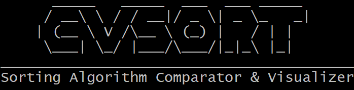
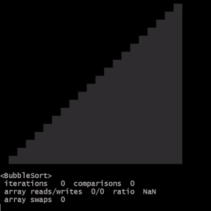

# Sorting Algorithm Comparator & Visualizer

Console program for fun with sorting algorithms.



Contains two main commands:
- **compare:** compares up to 10 sorting algorithms and shows their complexity and statistics
- **visualise:** shows algorithm complexity, pseudocode and/or visualisation with statistics

What the visualisation looks like on the _BubbleSort_ example:



## CLI 

To see what the program can do, type:

```shell
$ cvsort --help
```

For example, visualisation of BubbleSort:

```shell
$ cvsort visualise bubble
```

<details>
    <summary>Output</summary>

```shell
      _____   _____  ___  ___ _____
     / __\ \ / / __|/ _ \| _ \_   _|
    | (__ \ V /\__ \ (_) |   / | |
     \___| \_/ |___/\___/|_|_\ |_|
_________________________________________
Sorting Algorithm Comparator & Visualizer

┌───────────────┬───────────────┬───────────────┬───────────────┬──────────────┐
│Algorithm      │Worst time     │Average time   │Best time      │Memory usage  │
├───────────────┼───────────────┼───────────────┼───────────────┼──────────────┤
│BubbleSort     │O(n^2)         │Θ(n^2)         │Ω(n)           │O(1)          │
└───────────────┴───────────────┴───────────────┴───────────────┴──────────────┘

for i in [0..n) do
    swapped = false
    for j in [1..n-i) do
        if array[j-1] > array[j] then
            swap array[j] and array[j+1]
            swapped = true
        end
    end

    if not swapped then
        break
    end
end

                                ▒▒
                              ▒▒▒▒
                            ▒▒▒▒▒▒
                          ▒▒▒▒▒▒▒▒
                        ▒▒▒▒▒▒▒▒▒▒
                      ▒▒▒▒▒▒▒▒▒▒▒▒
                    ▒▒▒▒▒▒▒▒▒▒▒▒▒▒
                  ▒▒▒▒▒▒▒▒▒▒▒▒▒▒▒▒
                ▒▒▒▒▒▒▒▒▒▒▒▒▒▒▒▒▒▒
              ▒▒▒▒▒▒▒▒▒▒▒▒▒▒▒▒▒▒▒▒
            ▒▒▒▒▒▒▒▒▒▒▒▒▒▒▒▒▒▒▒▒▒▒
          ▒▒▒▒▒▒▒▒▒▒▒▒▒▒▒▒▒▒▒▒▒▒▒▒
        ▒▒▒▒▒▒▒▒▒▒▒▒▒▒▒▒▒▒▒▒▒▒▒▒▒▒
      ▒▒▒▒▒▒▒▒▒▒▒▒▒▒▒▒▒▒▒▒▒▒▒▒▒▒▒▒
    ▒▒▒▒▒▒▒▒▒▒▒▒▒▒▒▒▒▒▒▒▒▒▒▒▒▒▒▒▒▒
  ▒▒▒▒▒▒▒▒▒▒▒▒▒▒▒▒▒▒▒▒▒▒▒▒▒▒▒▒▒▒▒▒

<BubbleSort>
 iterations   121  comparisons  110
 array reads/writes  324/104  ratio  3.12
 array swaps  52
```

</details>

Or comparing SelectionSort & InsertionSort:

```shell
$ cvsort compare selection insertion
```

<details>
    <summary>Output</summary>

```shell
      _____   _____  ___  ___ _____
     / __\ \ / / __|/ _ \| _ \_   _|
    | (__ \ V /\__ \ (_) |   / | |
     \___| \_/ |___/\___/|_|_\ |_|
_________________________________________
Sorting Algorithm Comparator & Visualizer

┌───────────────┬───────────────┬───────────────┬───────────────┬──────────────┐
│Algorithm      │Worst time     │Average time   │Best time      │Memory usage  │
├───────────────┼───────────────┼───────────────┼───────────────┼──────────────┤
│SelectionSort  │O(n^2)         │Θ(n^2)         │Ω(n^2)         │O(1)          │
│InsertionSort  │O(n^2)         │Θ(n^2)         │Ω(n)           │O(1)          │
└───────────────┴───────────────┴───────────────┴───────────────┴──────────────┘

array size: 40
elapsed time: 23 ms

<SelectionSort>
 iterations   819  comparisons  780
 array reads/writes  1632/72  ratio  22.67
 array swaps  36

<InsertionSort>
 iterations   401  comparisons  39
 array reads/writes  796/422  ratio  1.89
 array swaps  0
```

</details>

## Supported sorting algorithms

- [BubbleSort](https://en.wikipedia.org/wiki/Bubble_sort)
- [SelectionSort](https://en.wikipedia.org/wiki/Selection_sort)
- [InsertionSort](https://en.wikipedia.org/wiki/Insertion_sort)
- [GnomeSort](https://en.wikipedia.org/wiki/Gnome_sort)
- [CocktailShakerSort](https://en.wikipedia.org/wiki/Cocktail_shaker_sort)
- [OddEvenSort](https://en.wikipedia.org/wiki/Odd%E2%80%93even_sort)